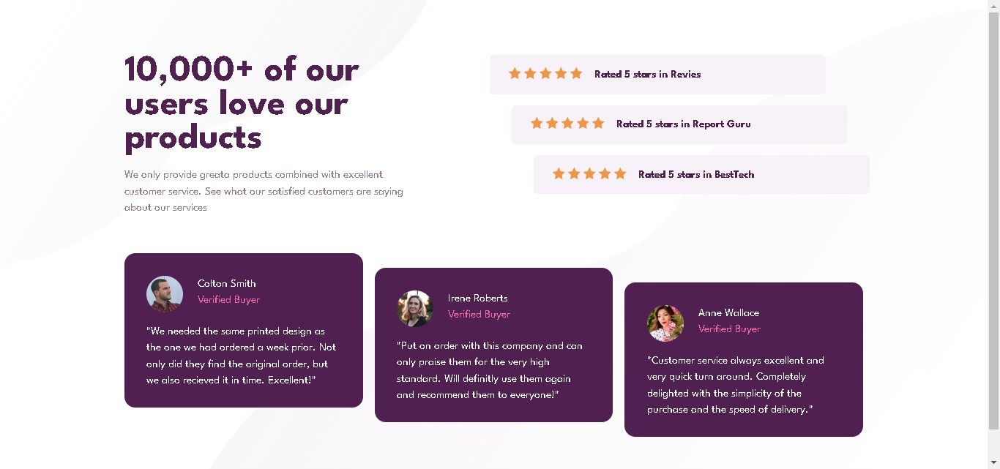

# Frontend Mentor - Social proof section solution

This is a solution to the [Social proof section challenge on Frontend Mentor](https://www.frontendmentor.io/challenges/social-proof-section-6e0qTv_bA). Frontend Mentor challenges help you improve your coding skills by building realistic projects. 

## Table of contents

- [Overview](#overview)
  - [The challenge](#the-challenge)
  - [Screenshot](#screenshot)
  - [Links](#links)
- [My process](#my-process)
  - [Built with](#built-with)
  - [What I learned](#what-i-learned)
  - [Continued development](#continued-development)
  - [Useful resources](#useful-resources)
- [Author](#author)
- [Acknowledgments](#acknowledgments)

**Note: Delete this note and update the table of contents based on what sections you keep.**

## Overview

### The challenge

This challange is from frontend mentor. (social proof )

Users should be able to:

- View the optimal layout for the section depending on their device's screen size

### Screenshot

- Solution URL: [Add solution URL here](https://your-solution-url.com)
- Live Site URL: [Add live site URL here](https://your-live-site-url.com)

## My process

### Built with

- Semantic HTML5 markup
- CSS custom properties
- Flexbox
- Mobile-first workflow

### What I learned

Mastering CSS Flexbox without relying on libraries was a pivotal learning experience for me in this project. Building a project solely with Flexbox deepened my understanding of its capabilities and refined my CSS skills. Through hands-on experimentation, I gained insights into Flexbox's versatility and its ability to create responsive layouts effortlessly. Embracing pure CSS allowed me to explore creative solutions and understand the trade-offs between libraries and custom code. This experience has equipped me with the confidence and skills to tackle future design challenges effectively.

### Continued development

On my journey to become a proficient fullstack develop, i will continue to learn the css flexbox and grid system to leverage power of responsive design.

### Useful resources

- (https://web.dev/learn/css) - I learn flexbox by reading the article on flexbox from this website. Kudos to them for 

## Author

- Frontend Mentor - [@Jerryhugo](https://www.frontendmentor.io/profile/Jerryhugo)
- 
